# Solución – Laboratorio #6: BluePrints en Tiempo Real (Java 21 / Spring Boot 3.3.x, STOMP)

**Escuela Colombiana de Ingeniería – Arquitecturas de Software**

**Autores:** Carlos Duban Rojas y Juan Daniel Bogotá Fuentes

**Repositorios del proyecto:**
- Frontend (este repositorio): <https://github.com/JuanBogota/LAB06-FRONTEND-ARSW2026-2>
- Backend: <https://github.com/JuanBogota/LAB06-BACKEND-ARSW2026-2>

Informe de laboratorio documentando la integración del front de BluePrints con un backend de tiempo real (STOMP sobre Spring Boot).

La solución del equipo está al final del documento.

---

## 📘 Enunciado – Lab P4 — BluePrints en Tiempo Real (Sockets & STOMP)

> **Repositorio:** `DECSIS-ECI/Lab_P4_BluePrints_RealTime-Sokets`  
> **Front:** React + Vite (Canvas, CRUD, y selector de tecnología RT)  
> **Backends guía (elige uno o compáralos):**
> - **Socket.IO (Node.js):** https://github.com/DECSIS-ECI/example-backend-socketio-node-/blob/main/README.md
> - **STOMP (Spring Boot):** https://github.com/DECSIS-ECI/example-backend-stopm/tree/main

## 🎯 Objetivo del laboratorio
Implementar **colaboración en tiempo real** para el caso de BluePrints. El Front consume la API CRUD de la Parte 3 (o equivalente) y habilita tiempo real usando **Socket.IO** o **STOMP**, para que múltiples clientes dibujen el mismo plano de forma simultánea.

Al finalizar, el equipo debe:
1. Integrar el Front con su **API CRUD** (listar/crear/actualizar/eliminar planos, y total de puntos por autor).
2. Conectar el Front a un backend de **tiempo real** (Socket.IO **o** STOMP) siguiendo los repos guía.
3. Demostrar **colaboración en vivo** (dos pestañas navegando el mismo plano).

---

## 🧩 Alcance y criterios funcionales
- **CRUD** (REST):
  - `GET /api/blueprints?author=:author` → lista por autor (incluye total de puntos).
  - `GET /api/blueprints/:author/:name` → puntos del plano.
  - `POST /api/blueprints` → crear.
  - `PUT /api/blueprints/:author/:name` → actualizar.
  - `DELETE /api/blueprints/:author/:name` → eliminar.
- **Tiempo real (RT)** (elige uno):
  - **Socket.IO** (rooms): `join-room`, `draw-event` → broadcast `blueprint-update`.
  - **STOMP** (topics): `@MessageMapping("/draw")` → `convertAndSend(/topic/blueprints.{author}.{name})`.
- **UI**:
  - Canvas con **dibujo por clic** (incremental).
  - Panel del autor: **tabla** de planos y **total de puntos** (`reduce`).
  - Barra de acciones: **Create / Save/Update / Delete** y **selector de tecnología** (None / Socket.IO / STOMP).
- **DX/Calidad**: código limpio, manejo de errores, README de equipo.

---

## 🏗️ Arquitectura (visión rápida)

```
React (Vite)
 ├─ HTTP (REST CRUD + estado inicial) ───────────────> Tu API (P3 / propia)
 └─ Tiempo Real (elige uno):
     ├─ Socket.IO: join-room / draw-event ──────────> Socket.IO Server (Node)
     └─ STOMP: /app/draw -> /topic/blueprints.* ────> Spring WebSocket/STOMP
```

**Convenciones recomendadas**  
- **Plano como canal/sala**: `blueprints.{author}.{name}`  
- **Payload de punto**: `{ x, y }`

---

## 📦 Repos guía (clona/consulta)
- **Socket.IO (Node.js)**: https://github.com/DECSIS-ECI/example-backend-socketio-node-/blob/main/README.md  
  - *Uso típico en el cliente:* `io(VITE_IO_BASE, { transports: ['websocket'] })`, `join-room`, `draw-event`, `blueprint-update`.
- **STOMP (Spring Boot)**: https://github.com/DECSIS-ECI/example-backend-stopm/tree/main  
  - *Uso típico en el cliente:* `@stomp/stompjs` → `client.publish('/app/draw', body)`; suscripción a `/topic/blueprints.{author}.{name}`.

---

## ⚙️ Variables de entorno (Front)
Crea `.env.local` en la raíz del proyecto **Front**:
```bash
# REST (tu backend CRUD)
VITE_API_BASE=http://localhost:8080

# Tiempo real: apunta a uno u otro según el backend que uses
VITE_IO_BASE=http://localhost:3001     # si usas Socket.IO (Node)
VITE_STOMP_BASE=http://localhost:8080  # si usas STOMP (Spring)
```
En la UI, selecciona la tecnología en el **selector RT**.

---

## 🚀 Puesta en marcha

### 1) Backend RT (elige uno)

**Opción A — Socket.IO (Node.js)**  
Sigue el README del repo guía:  
https://github.com/DECSIS-ECI/example-backend-socketio-node-/blob/main/README.md
```bash
npm i
npm run dev
# expone: http://localhost:3001
# prueba rápida del estado inicial:
curl http://localhost:3001/api/blueprints/juan/plano-1
```

**Opción B — STOMP (Spring Boot)**  
Sigue el repo guía:  
https://github.com/DECSIS-ECI/example-backend-stopm/tree/main
```bash
./mvnw spring-boot:run
# expone: http://localhost:8080
# endpoint WS (ej.): /ws-blueprints
```

### 2) Front (este repo)
```bash
npm i
npm run dev
# http://localhost:5173
```
En la interfaz: selecciona **Socket.IO** o **STOMP**, define `author` y `name`, abre **dos pestañas** y dibuja en el canvas (clics).

---

## 🔌 Protocolos de Tiempo Real (detalle mínimo)

### A) Socket.IO
- **Unirse a sala**
  ```js
  socket.emit('join-room', `blueprints.${author}.${name}`)
  ```
- **Enviar punto**
  ```js
  socket.emit('draw-event', { room, author, name, point: { x, y } })
  ```
- **Recibir actualización**
  ```js
  socket.on('blueprint-update', (upd) => { /* append points y repintar */ })
  ```

### B) STOMP
- **Publicar punto**
  ```js
  client.publish({ destination: '/app/draw', body: JSON.stringify({ author, name, point }) })
  ```
- **Suscribirse a tópico**
  ```js
  client.subscribe(`/topic/blueprints.${author}.${name}`, (msg) => { /* append points y repintar */ })
  ```

---

## 🧪 Casos de prueba mínimos
- **Estado inicial**: al seleccionar plano, el canvas carga puntos (`GET /api/blueprints/:author/:name`).  
- **Dibujo local**: clic en canvas agrega puntos y redibuja.  
- **RT multi-pestaña**: con 2 pestañas, los puntos se **replican** casi en tiempo real.  
- **CRUD**: Create/Save/Delete funcionan y refrescan la lista y el **Total** del autor.

---

## 📊 Entregables del equipo
1. Código del Front integrado con **CRUD** y **RT** (Socket.IO o STOMP).  
2. **Video corto** (≤ 90s) mostrando colaboración en vivo y operaciones CRUD.  
3. **README del equipo**: setup, endpoints usados, decisiones (rooms/tópicos), y (opcional) breve comparativa Socket.IO vs STOMP.

---

## 🧮 Rúbrica sugerida
- **Funcionalidad (40%)**: RT estable (join/broadcast), aislamiento por plano, CRUD operativo.  
- **Calidad técnica (30%)**: estructura limpia, manejo de errores, documentación clara.  
- **Observabilidad/DX (15%)**: logs útiles (conexión, eventos), health checks básicos.  
- **Análisis (15%)**: hallazgos (latencia/reconexión) y, si aplica, pros/cons Socket.IO vs STOMP.

---

## 🩺 Troubleshooting
- **Pantalla en blanco (Front)**: revisa consola; confirma `@vitejs/plugin-react` instalado y que `AppP4.jsx` esté en `src/`.  
- **No hay broadcast**: ambas pestañas deben hacer `join-room` al **mismo** plano (Socket.IO) o suscribirse al **mismo tópico** (STOMP).  
- **CORS**: en dev permite `http://localhost:5173`; en prod, **restringe orígenes**.  
- **Socket.IO no conecta**: fuerza transporte WebSocket `{ transports: ['websocket'] }`.  
- **STOMP no recibe**: verifica `brokerURL`/`webSocketFactory` y los prefijos `/app` y `/topic` en Spring.

---

## 🔐 Seguridad (mínimos)
- Validación de payloads (p. ej., zod/joi).  
- Restricción de orígenes en prod.  
- Opcional: **JWT** + autorización por plano/sala.

---

## 📄 Licencia
MIT (o la definida por el curso/equipo).

---

# 📝 Solución del equipo

## 🖥️ Entorno de desarrollo

| Herramienta | Versión |
|---|---|
| Java (JDK instalado) | 25.0.1 (el código se compila con `release 21`) |
| Maven | 3.9.12 |
| Node.js | v24.21.0 |
| npm | 11.19.0 |
| Spring Boot | 3.3.4 |
| Sistema operativo | Windows 11 |

## ▶️ Cómo ejecutar nuestra solución

**1) Backend** ([repositorio](https://github.com/JuanBogota/LAB06-BACKEND-ARSW2026-2)):

```bash
git clone https://github.com/JuanBogota/LAB06-BACKEND-ARSW2026-2.git
cd LAB06-BACKEND-ARSW2026-2
docker compose up -d      # PostgreSQL
mvn spring-boot:run       # API en http://localhost:8080
```

**2) Frontend** (este repositorio). Crear `.env.local` en la raíz con:

```bash
VITE_API_BASE=http://localhost:8080
VITE_STOMP_BASE=http://localhost:8080
```

y luego:

```bash
npm i
npm run dev               # http://localhost:5173
```

Para probar la colaboración, abre dos pestañas en `http://localhost:5173` con el mismo autor y plano. Antes hay que crear el plano de prueba (ver el README del backend).


## 📖 Actividades del laboratorio

### 1. Línea base: front y backend guía

Se levantó el front (React + Vite, puerto 5173) y el backend STOMP de ejemplo (Spring Boot 3.3.4, puerto 8080) para observar el comportamiento inicial antes de integrar nuestra API. El estado inicial del plano se pide por REST (GET /api/blueprints/{author}/{name}) y los puntos nuevos viajan por STOMP: el cliente publica en /app/draw y el backend difunde a /topic/blueprints.{author}.{name}.

Para ejecutar el backend fue necesario corregir su pom.xml y agregar una configuración de CORS. Se configuró el .env.local del front así:

```bash
VITE_API_BASE=http://localhost:8080
VITE_STOMP_BASE=http://localhost:8080
```

`CorsConfig.java`:

```java
@Configuration
public class CorsConfig implements WebMvcConfigurer {
  @Override
  public void addCorsMappings(CorsRegistry registry) {
    registry.addMapping("/api/**")
            .allowedOrigins("http://localhost:5173")
            .allowedMethods("GET", "POST", "PUT", "DELETE");
  }
}
```

**Evidencia**

Estado inicial por REST:

```text
PS C:\Users\juanb> curl.exe -i http://localhost:8080/api/blueprints/juan/plano-1
HTTP/1.1 200
Content-Type: application/json
Transfer-Encoding: chunked
Date: Thu, 01 Oct 2026 19:22:13 GMT

{"author":"juan","name":"plano-1","points":[{"x":10,"y":10},{"x":40,"y":50}]}
```

Canvas con el plano cargado:

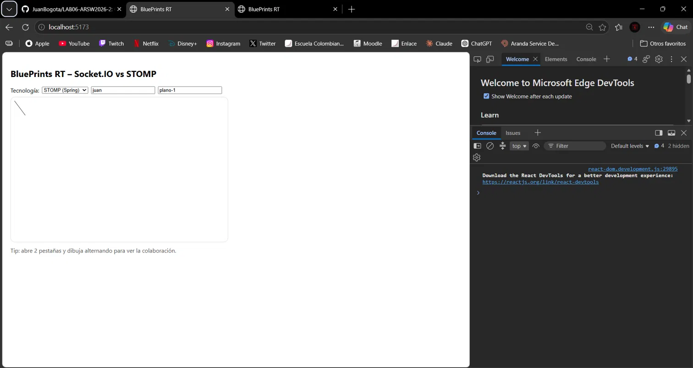

Comportamiento tras hacer un clic en la pestaña 1 (ambas pestañas quedan en blanco):


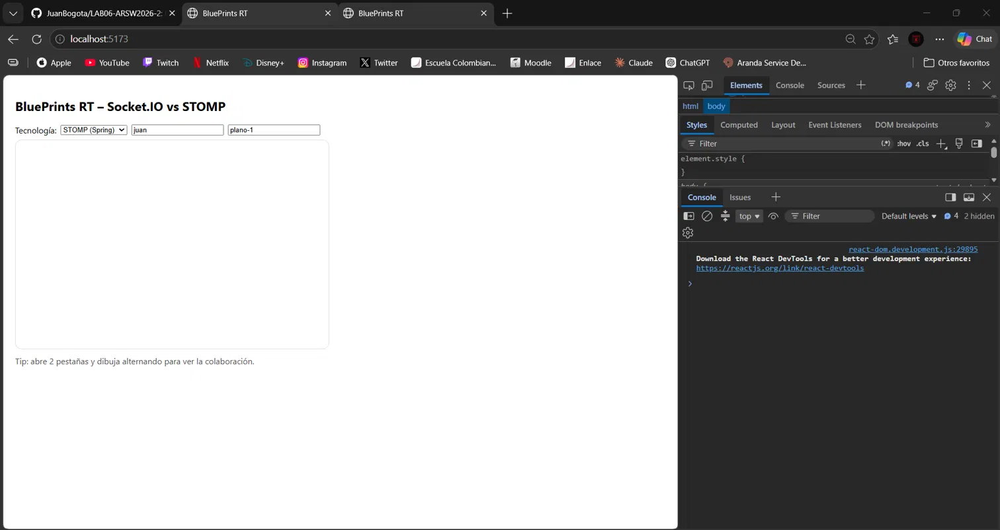

Tráfico STOMP observado en DevTools. Tras tres clics se ven tres pares SEND y MESSAGE:

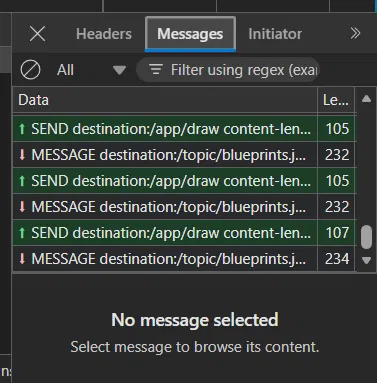


El tráfico del WebSocket confirma el flujo publicar/suscribir: cada punto enviado a /app/draw produce un mensaje de vuelta desde el tópico del plano, y esa es la notificación que recibe la otra pestaña. Ambos canvas quedan en blanco tras el clic porque, el backend difunde solo el punto nuevo y el front redibuja únicamente lo que recibe (drawAll limpia el canvas y un único punto no produce trazo).


---

### 2. Integración de STOMP a nuestra API CRUD (puertos y adaptadores)

Se descartó el backend guía y se agregó STOMP directamente a nuestra API (LAB03: Spring Boot, PostgreSQL, rutas /api/v1/blueprints). Así todo corre en un solo proceso en el puerto 8080.

Cuando alguien hace clic en el canvas, el navegador envía el punto al servidor. El servidor lo valida y lo reenvía a todos los que están viendo el mismo plano. Para lograrlo se separó el trabajo en tres partes, de modo que la lógica no dependa de la tecnología de mensajería:

| Clase | Qué hace |
|---|---|
| DrawController | Recibe el mensaje que llega desde el navegador |
| DrawingService | Revisa que los datos sean válidos |
| StompBlueprintEventPublisher | Envía el punto a los demás usuarios |
---

Además se agregaron WebSocketConfig (configura el canal de conexión /ws-blueprints) y CorsConfig (permite que el front en localhost:5173 se comunique con la API).

Solo se envía el punto nuevo, no el plano completo. Los clics no se guardan en la base de datos. Solo se reenvían a los demás. El plano se guarda cuando el usuario presiona Save. Así se evitan muchas escrituras, pero quien entra tarde no ve puntos que aún no se hayan guardado.

Se validan los nombres. El autor y el plano solo pueden tener letras, números, _ y -. Esto evita que nombres como a.b se confundan con otros canales.

Encontramos un problema al arrancar LAB03 con el backend guía todavía encendido, falló con el mensaje "Web server failed to start. Port 8080 was already in use". Los dos usan el mismo puerto, así que no pueden estar encendidos a la vez.

**Evidencia del caso aprobado:**

Al hacer un clic, el navegador se conecta, se suscribe al plano, envía el punto y recibe de vuelta el mensaje del servidor:

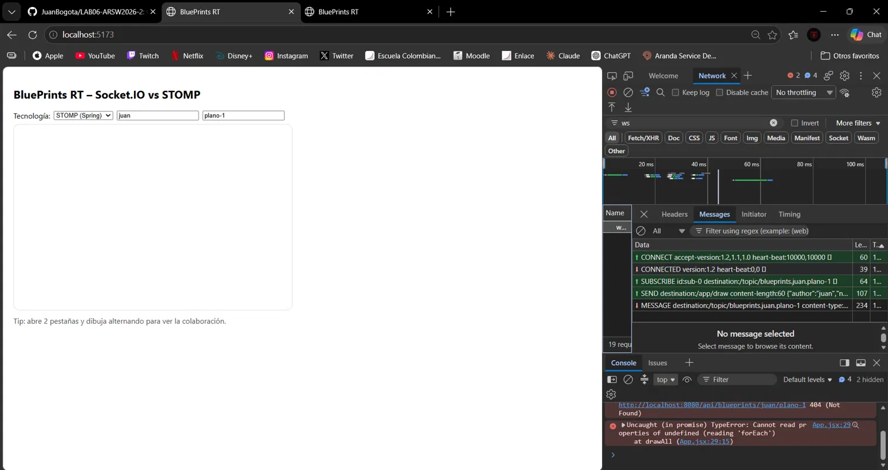

En la terminal de LAB03 se ve cada punto publicado:

```text
2026-10-01T16:18:15.129-05:00  INFO ... StompBlueprintEventPublisher : Punto Point[x=210, y=97] publicado en /topic/blueprints.juan.plano-1
2026-10-01T16:21:03.326-05:00  INFO ... StompBlueprintEventPublisher : Punto Point[x=417, y=114] publicado en /topic/blueprints.juan.plano-1
2026-10-01T16:21:03.863-05:00  INFO ... StompBlueprintEventPublisher : Punto Point[x=314, y=130] publicado en /topic/blueprints.juan.plano-1
```

**Evidencia del caso rechazado:**

Con el autor a.b el navegador envía los puntos, pero el servidor no responde con ningún mensaje, porque ese nombre no es válido:

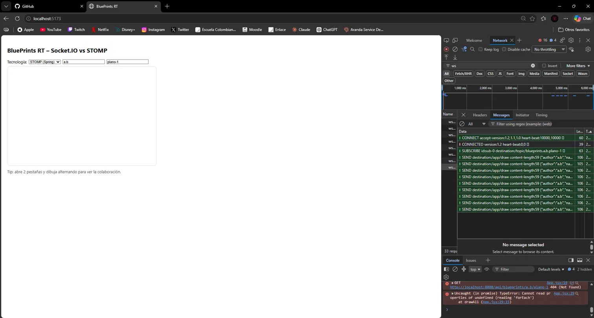

En la terminal de LAB03 aparece el aviso de rechazo:

```text
2026-10-01T20:21:30.865-05:00  WARN ... DrawController : Mensaje /draw rechazado: author y name deben ser alfanuméricos (_ y - permitidos) y point es obligatorio
2026-10-01T20:21:43.897-05:00  WARN ... DrawController : Mensaje /draw rechazado: author y name deben ser alfanuméricos (_ y - permitidos) y point es obligatorio
```

STOMP funciona contra nuestra API: los puntos válidos se reenvían a todos los que ven el plano y los inválidos se rechazan y quedan registrados en el log. Separar la recepción, la validación y el envío en tres clases permite cambiar la tecnología de mensajería sin tocar la lógica del negocio, que es la idea de la Arquitectura Hexagonal. Además, el envío por canales (publicar/suscribirse) hace que quien dibuja no tenga que saber quién está mirando.

---

### 3. Front: carga del plano y puntos acumulados

Se arregló el front para que se conecte bien a nuestra API (LAB03) y para que el canvas vaya sumando los puntos que llegan, en vez de borrarse.

Con STOMP activo, el clic no dibuja al instante, envía el punto al servidor y lo dibuja cuando el servidor lo devuelve por el tópico. Así todos los usuarios ven los puntos en el mismo orden. El costo es que, si se cae la conexión, el clic no dibuja. La otra opción era dibujar al instante y descartar el eco, pero eso exige que el servidor indique quién envió cada punto. Sin tiempo real, el clic dibuja de forma local.

**Evidencia**

Crear el plano de prueba en la API (se hizo desde un clon limpio del backend):

```text
PS C:\...\LAB06-BACKEND-ARSW2026-2> curl.exe -i -X POST http://localhost:8080/api/v1/blueprints -H "Content-Type: application/json" --data-binary "@plano.json"
HTTP/1.1 201
Content-Type: application/json
Date: Fri, 02 Oct 2026 02:20:08 GMT

{"code":201,"message":"resource created","data":{"author":"juan","name":"plano-1","points":[{"x":10,"y":10},{"x":40,"y":50},{"x":120,"y":60}]}}
```

Plano cargado, con sus tres puntos marcados:

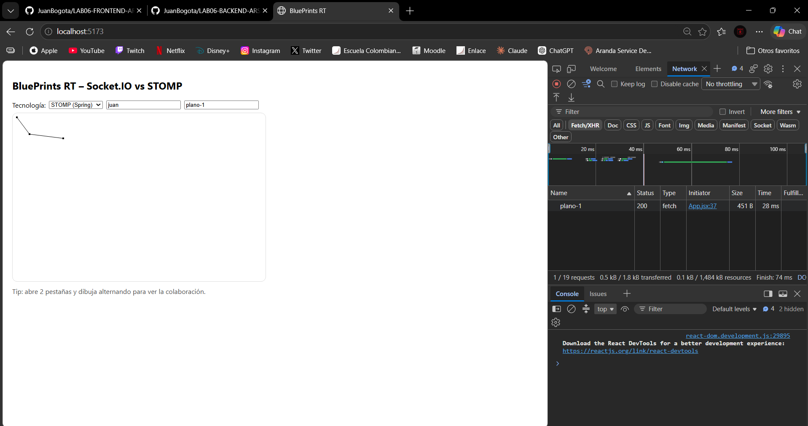

El canvas con los puntos acumulados de cada clic:

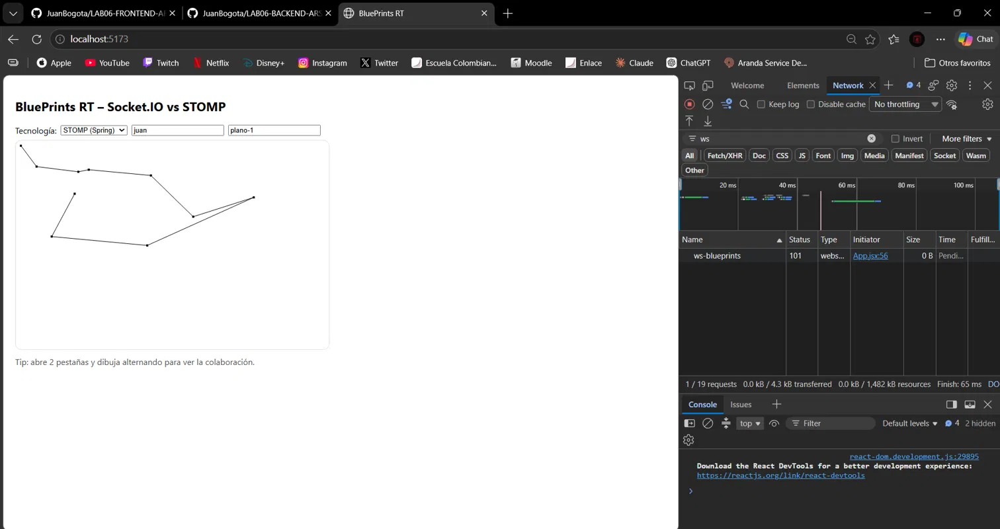

Contenido real de un mensaje que llega del servidor:

```text
MESSAGE
destination:/topic/blueprints.juan.plano-1
content-type:application/json
content-length:63

{"author":"juan","name":"plano-1","points":[{"x":262,"y":203}]}
```

Al cerrar la conexión se ven UNSUBSCRIBE, DISCONNECT y la confirmación RECEIPT del servidor, es decir, un cierre ordenado:

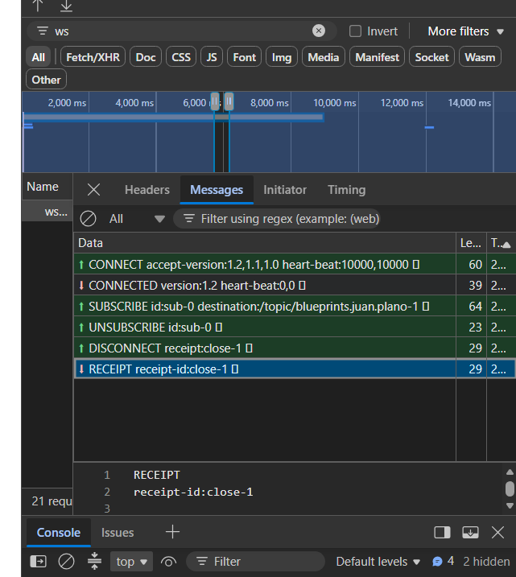

--- 

### 4. Prueba de colaboración en vivo (2 pestañas)

Se probó el sistema con varias pestañas sobre el mismo plano (juan / plano-1) y se observó qué pasa cuando el servidor se cae y vuelve.

**Pruebas y resultados**

| Prueba | Qué se hizo | Qué pasó |
|---|---|---|
| A. Colaboración | Dos pestañas en el mismo plano, haciendo clic por turnos | Cada punto aparece en las dos pestañas, con el mismo dibujo |
| B. Quien entra tarde | Se abrió una tercera pestaña después de dibujar | Solo muestra los 3 puntos originales guardados, no ve lo dibujado en vivo |
| C1. Servidor caído | Se detuvo el backend | El navegador reintenta conectarse y falla con ERR_CONNECTION_REFUSED |
| C2. Clic con servidor caído | Un clic en la pestaña A | El punto se dibuja solo en A, la otra pestaña no lo recibe |
| C3. Servidor de vuelta | Se encendió el backend y se hizo un clic en A, sin recargar | El punto aparece en las dos pestañas, la reconexión funcionó sola |

**Evidencia**

Colaboración y pestaña que entra tarde (las dos de la derecha son iguales; la de la izquierda solo tiene los 3 puntos originales):

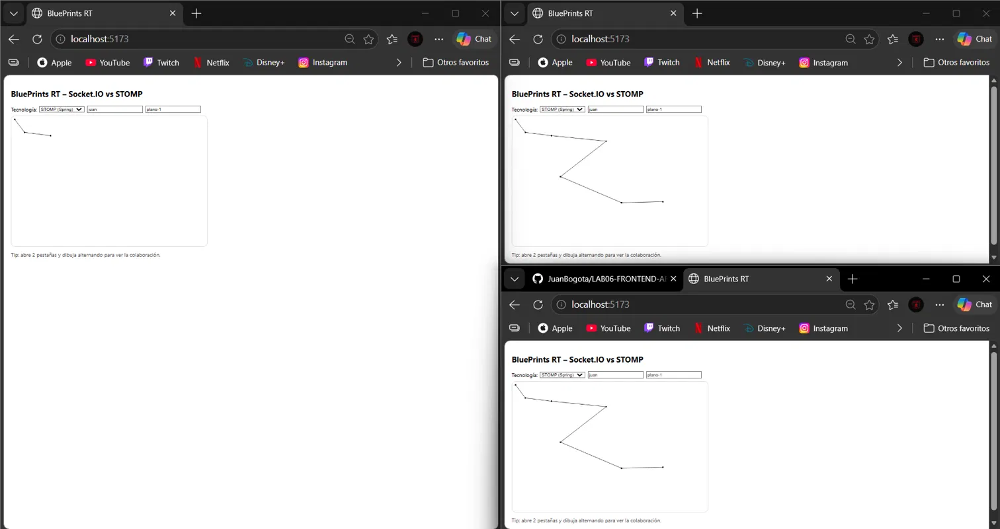

Servidor apagado, con el error de conexión en el WS:

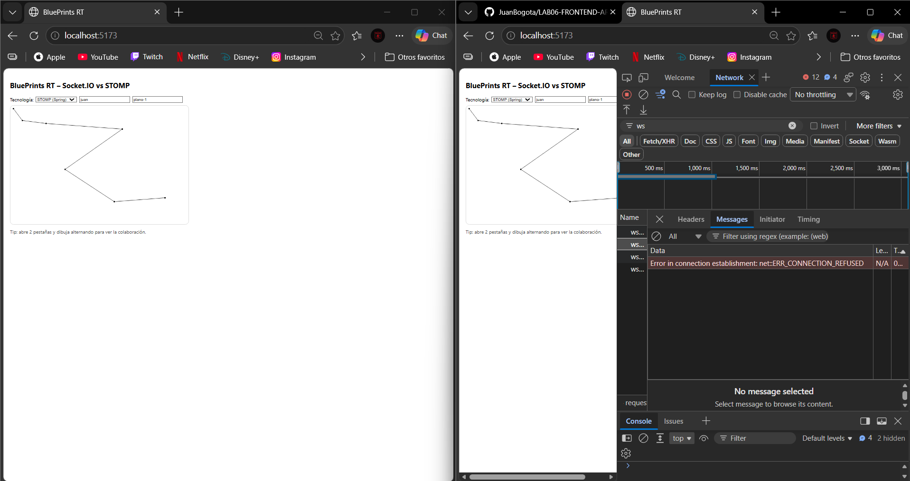

Un clic con el servidor apagado, el punto aparece solo en la pestaña de la derecha:

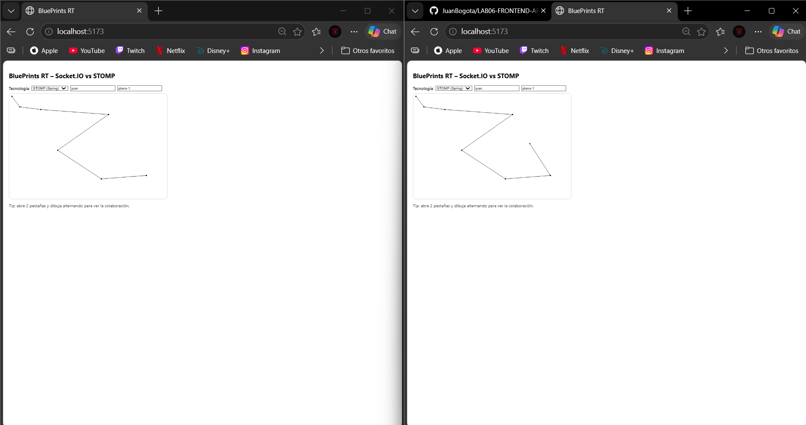

Servidor encendido y un clic en la pestaña de la derecha: el punto nuevo llega a las dos pestañas, pero la de la derecha conserva además el punto dibujado durante la caída:

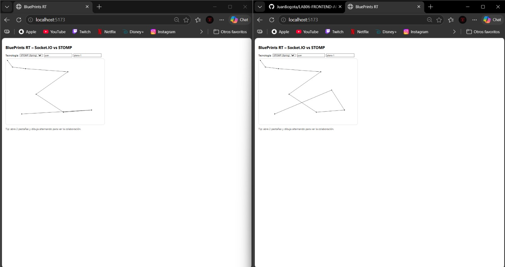


La reconexión es automática. El cliente reintenta cada segundo y, al volver el servidor, se conecta y se suscribe de nuevo sin recargar la página.

Lo dibujado durante una caída no se sincroniza. Si el servidor está apagado, el clic se dibuja solo en esa pestaña y esa pestaña queda distinta de las demás, sin avisar al usuario.

Lo dibujado en vivo no se guarda. Quien entra tarde, o recarga, solo ve lo que ya estaba guardado en la base de datos. Es lo que decisidimos en la actividad 2.

Se podría mejorar mostrar un indicador "conectado / sin conexión" y no dibujar mientras no haya conexión; al reconectarse, volver a pedir el plano por REST, o guardar cada punto en el servidor antes de difundirlo, a costa de una escritura por clic y de cuidar la concurrencia.

### 5. CRUD en la UI y total de puntos por autor

**Evidencia**

Panel del autor 'ana': la tabla lista cada plano con su número de puntos y el Total.

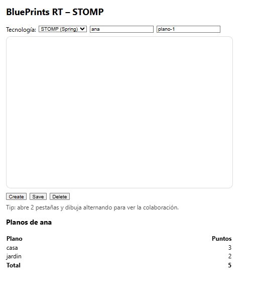

Save exitoso: el plano queda guardado en el servidor y la lista se refresca.

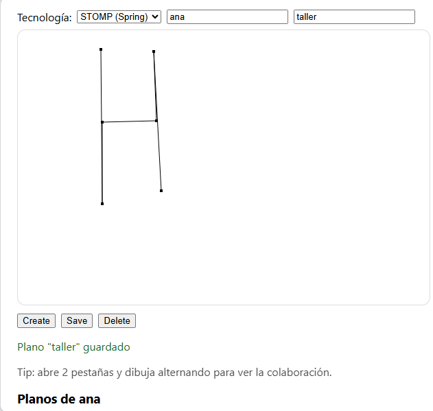 

Save sobre un plano que no existe: el servidor responde 404 y la interfaz muestra el error.

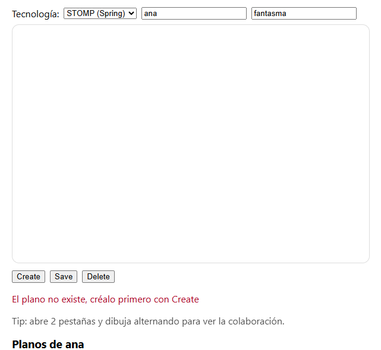 

Delete exitoso: el canvas se limpia y el plano sale de la tabla

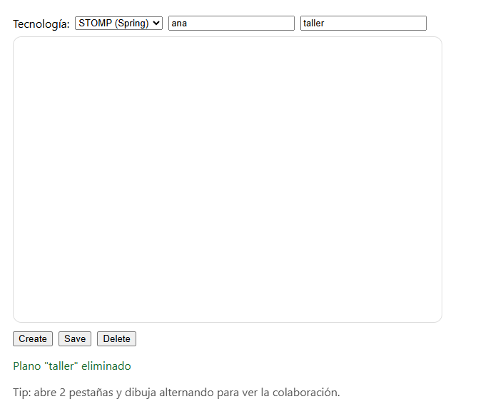 

Segundo Delete del mismo plano: el servidor responde 404 y se muestra el error.

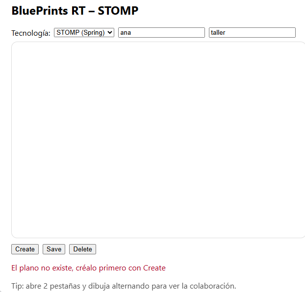 

Backend detenido: la interfaz muestra que no puede conectarse

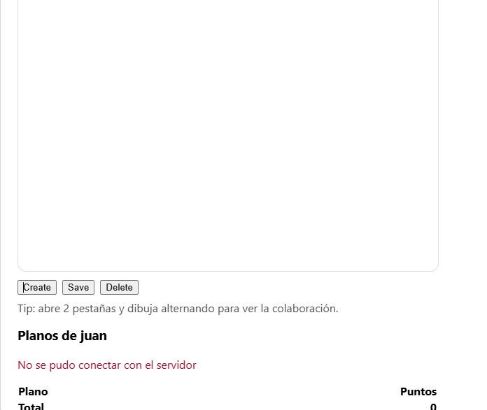
### 6. Selector de tecnología (None / STOMP)

Como elegimos STOMP como backend de tiempo real, el selector tiene dos opciones: None (solo local) y STOMP (Spring). Se eliminó el código de Socket.IO porque nuestro backend no lo usa.

**Por qué STOMP y no Socket.IO**

| | STOMP (elegido) | Socket.IO |
|---|---|---|
| Dónde corre | Dentro de nuestra misma API Spring | Habría que montar un servicio Node aparte |
| Procesos a operar | 1 | 2 |
| Reutilización | Usa la misma validación y configuración de la API | Habría que repetirlas o conectar ambos servicios |

**Cómo se comporta cada opción**

| Opción | Conexión | Qué hace el clic |
|---|---|---|
| STOMP | Abre la conexión WebSocket y se suscribe al plano | Envía el punto al servidor y lo dibuja cuando el servidor lo devuelve |
| None | No abre ninguna conexión | Dibuja el punto solo en esa pestaña |

Al volver de "None" a "STOMP" se vuelve a pedir el plano guardado, así que lo dibujado en modo local se descarta. Con eso la pestaña no queda distinta de las demás.

**Evidencia**

Al cambiar a "None", la conexión anterior se cierra en orden (UNSUBSCRIBE, DISCONNECT, RECEIPT) y no se abre ninguna nueva:

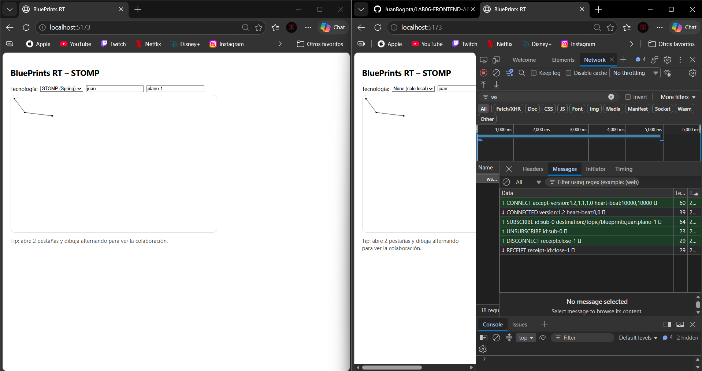

Un clic en la pestaña con "None" dibuja el punto solo ahí, la pestaña en STOMP no lo recibe:

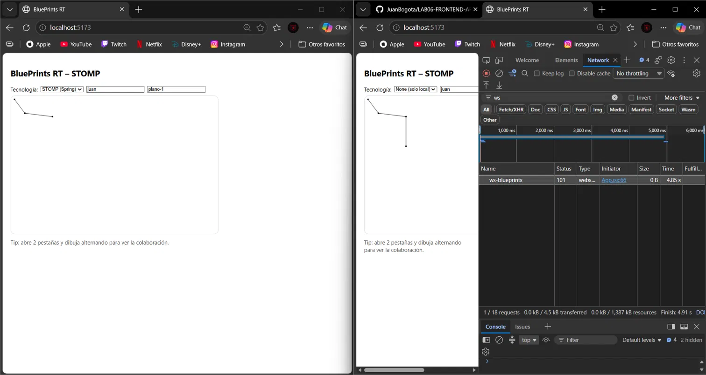

Al volver a "STOMP" se abre una conexión nueva y el canvas vuelve al plano guardado:

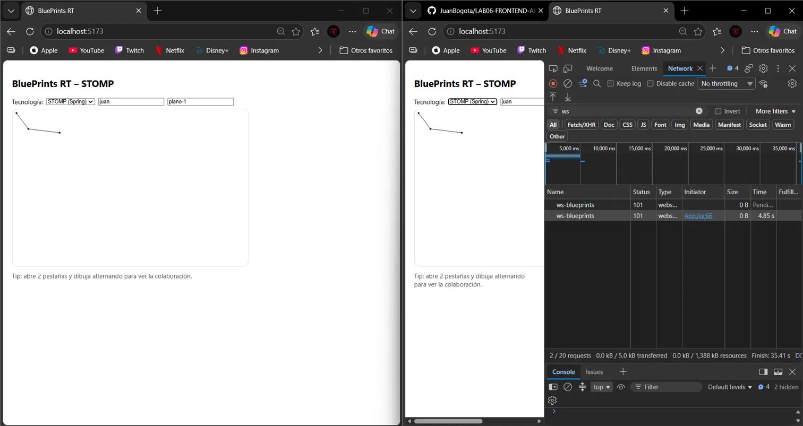

None muestra que la aplicación sigue funcionando sin tiempo real, el dibujo local se mantiene aunque no haya conexión. Tener el transporte como una opción intercambiable en el front es el mismo criterio de adaptadores que se aplicó en el backend.


### 7. Observabilidad, análisis y decisiones

*(pendiente)*

---